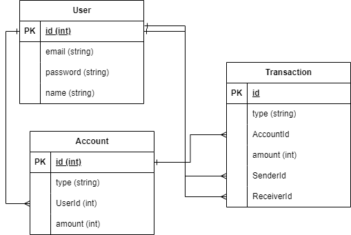

# Implementation    
I implemented the application using PostgreSQL for database, Prisma ORM, and Fastify. The web application and the database is containerized and you can run it with just running `docker compose up`, though it should be noted that it can take up 1 minute to spin up the server. The default database name used here is `mydb`. The base url for the backend server is `http://localhost:4000`.     

## ERD  
  
  
## API Documentations  
### Authentication Scheme  
The authentication used in this application is cookie auth and after login the token will be saved on cookie. If you are testing this on postman or swagger you just need to register, then login once and then the cookie for authentication is automatically set  

### Swagger Docs  
`http://localhost:4000/docs`  
 
### Account Manager Endpoints  
url: `http://localhost:4000/api/account`  
list of available endpoints:  
- `POST /register`  
- `POST /login`  
- `POST /`  
- `GET /`  
- `GET /transactions/:accountId`

### Payment Manager Endpoints  
url: `http://localhost:4000/api/payment`  
list of available endpoints:  
- `POST /send`  
- `POST /recurring`  
- `POST /withdraw`  
