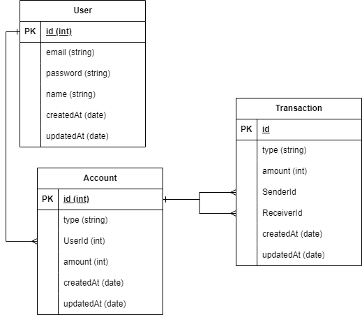

# Implementation    
I implemented the application using PostgreSQL for database, Prisma ORM, and Fastify. The web application and the database is containerized and you can run it with just running `docker compose up`. The default database name used here is `mydb`. The base url for the backend server is `http://localhost:4000`.     

## ERD  
  